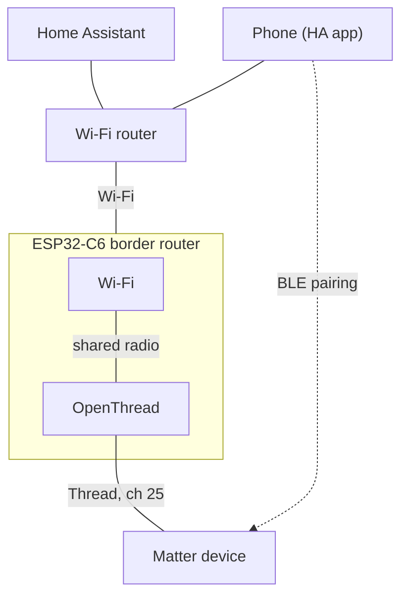
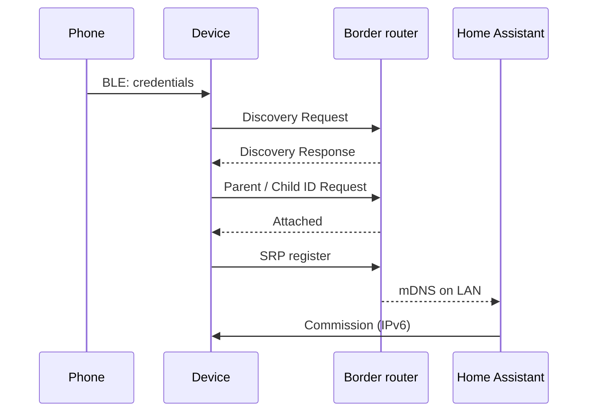

I recently bought a few of IKEA's new Matter devices. They run Matter over Thread, the low-power mesh a lot of newer sensors, bulbs and plugs use. To talk to them from your LAN (and from Home Assistant) you need a Thread Border Router, or OTBR: something that sits on both your Wi-Fi network and the Thread mesh and routes IPv6 between them.

I knew that before buying. I'd also read in a few blog posts that Alexa could act as one, so I assumed I was covered. I wasn't. My Echo is the wrong generation and has no Thread border router in it.

That left a few options, none of them great for what was meant to be a small weekend project:

- A dedicated border router. Those run somewhere around $70 to $150.
- IKEA's own hub. Also more than I wanted to spend, and I'd rather not be locked into IKEA for every device I buy from here on.
- Something cheaper and more hands-on.

Digging around, I found that the ESP32-C6 has Wi-Fi 6 and an IEEE 802.15.4 (Thread/Zigbee) radio on the same chip, and ESP-IDF ships a ready-made border router example for it. I paid about $5 for a board on AliExpress.

Only later did I properly understand the catch: the C6 has a single radio, shared between Wi-Fi and Thread, so the two compete for airtime and packets can get delayed. Espressif doesn't recommend it for production or larger networks. For me that's fine. I was testing, I wanted cheap, and I have a handful of devices, not fifty.

Getting it working with Home Assistant took more effort than I expected, mostly because of a Matter device that refused to pair and a border router that logged nothing about why. It's all running now and every device is behaving. This post covers the build, the Home Assistant setup, and how I tracked down the pairing failure.

**TL;DR**

- Build `esp-idf/examples/openthread/ot_br` for `esp32c6`. The native 802.15.4 radio and Wi-Fi/Thread coexistence are already on by default for the C6.
- Set your Wi-Fi credentials and flash size, and move the console to USB Serial/JTAG, or the CLI won't accept typed commands over the USB cable.
- Don't keep the default Thread network. Its network key ships with every copy of ESP-IDF. Run `ot dataset init new`.
- In Home Assistant, add the dataset to the Thread integration, make it preferred, and sync the credentials to your phone.
- If pairing fails, factory-reset the device before trying again. It can hang on to a stale network key from the failed attempt, and the border router drops those packets without saying a word.

---

## What you need

| Item | Notes |
|---|---|
| ESP32-C6 dev board | [This one from AliExpress](https://www.aliexpress.com/item/1005007625276593.html). Buy at least the 8 MB flash version; I used 16 MB. The app is ~1.8 MB, so smaller variants leave little room to grow the app partition. |
| USB-C cable | Must carry data. The C6's built-in USB Serial/JTAG handles flashing *and* the CLI. |
| Computer | I used macOS. Linux and Windows are the same with ESP-IDF. |
| 2.4 GHz Wi-Fi | The border router's backbone link. Needs IPv6 link-local, which any normal router does. |
| Home Assistant | With the Thread and Matter integrations, plus the HA Companion app on your phone. |
| A Matter-over-Thread device | Something to pair. |

## How it fits together



## Single-chip vs two-chip border router

The `ot_br` README recommends two chips: a Wi-Fi SoC running `ot_br`, plus an ESP32-H2 running `ot_rcp` as a radio co-processor over UART. The reason is that the ESP32-C6 has one RF path. Wi-Fi and Thread take turns on the radio and can't both receive at the same moment.

For a home with a handful of devices, one chip is fine, and it's the fastest way to get going. Sharing does have a cost, and I measured it (see Performance): a big chunk of Thread transmissions hit "channel busy" (CCA failure) on the first try and had to be retried. If the network grows, you can add an ESP32-H2 as an RCP later. Same firmware, different config.

## Install ESP-IDF

```sh
mkdir -p ~/projects/esp && cd ~/projects/esp
git clone --recursive https://github.com/espressif/esp-idf.git
cd esp-idf
git checkout v6.1            # a release tag is safer than master
git submodule update --init --recursive
./install.sh esp32c6
. ./export.sh                # run this in every new shell
```

> I built and tested on ESP-IDF `master` (v6.1-dev). Use a tagged release if you want fewer surprises.

## Configure the ot_br example for ESP32-C6

```sh
cd ~/projects/esp/esp-idf/examples/openthread/ot_br
idf.py set-target esp32c6
idf.py menuconfig
```

> Tip: copy `examples/openthread/ot_br` out of the ESP-IDF tree first so your changes don't end up in its git history. It builds fine elsewhere as long as `export.sh` has set `IDF_PATH`.

Here's what I changed or checked, with where to find it in `menuconfig`.

### 1. Radio: native 802.15.4 (default on C6)

`Component config → OpenThread → Thread Core Features → Thread 15.4 Radio Link → Native 15.4 radio`

```
CONFIG_OPENTHREAD_RADIO_NATIVE=y
```

On chips without an 802.15.4 radio, the example defaults to `RADIO_SPINEL_UART` (external RCP). The C6 gets native.

### 2. Wi-Fi/Thread coexistence (default on)

`Component config → Wireless Coexistence → Software controls WiFi/Bluetooth coexistence`

```
CONFIG_ESP_COEX_SW_COEXIST_ENABLE=y
```

You need this when Wi-Fi and Thread share a radio. With it on, the example calls `esp_coex_wifi_i154_enable()` at startup.

### 3. Wi-Fi credentials and auto start

`Example Connection Configuration → WiFi SSID / WiFi Password`
`Component config → OpenThread → ... → Enable the automatic start mode in Thread` (the `OPENTHREAD_NETWORK_AUTO_START` option)

```
CONFIG_EXAMPLE_CONNECT_WIFI=y
CONFIG_EXAMPLE_WIFI_SSID="your-ssid"
CONFIG_EXAMPLE_WIFI_PASSWORD="your-password"
CONFIG_OPENTHREAD_NETWORK_AUTO_START=y
```

With auto start on, the board joins Wi-Fi and brings Thread up on every boot. No typing required. If there's already an active dataset in flash (NVS), it reuses that. If not, it falls back to the Kconfig defaults, which comes back to bite in a later section.

If you'd rather drive it by hand, turn auto start off, enable `OPENTHREAD_CLI_ESP_EXTENSION`, and connect with `ot wifi connect -s <ssid> -p <psk>` from the CLI.

### 4. Wait for IPv6 link-local before starting border routing

```
CONFIG_EXAMPLE_CONNECT_IPV6=y
CONFIG_EXAMPLE_CONNECT_IPV6_PREF_LOCAL_LINK=y
```

Without these, `example_connect()` returns as soon as IPv4 is up. Border routing then tries to send Router Solicitations before the Wi-Fi interface has finished DAD on its link-local address, and you get a few `Failed to send RS x/3` errors at boot. Harmless, but noisy, and they send you looking in the wrong place.

### 5. Flash size

`Serial flasher config → Flash size`

```
CONFIG_ESPTOOLPY_FLASHSIZE_16MB=y   # match your module
```

The default partition table gives the app a 2000K `factory` partition. The border router binary is ~1.8 MB, so that's only about 10% headroom. On a 16 MB board, grow it in `partitions.csv`:

```
# Name,   Type, SubType, Offset,  Size, Flags
nvs,        data, nvs,      ,  0x6000,
phy_init,   data, phy,      ,  0x1000,
factory,    app,  factory,  , 4M,
```

### 6. Console on USB Serial/JTAG (important for dev boards)

`Component config → ESP System Settings → Channel for console output → USB Serial/JTAG Controller`

```
CONFIG_ESP_CONSOLE_USB_SERIAL_JTAG=y
CONFIG_ESP_CONSOLE_SECONDARY_NONE=y
```

This one got me. By default the primary console is UART0, and USB Serial/JTAG is a secondary console that only does output. Plug into the C6's native USB port and you'll see logs scrolling past, but anything you type (`ot state`, whatever) goes nowhere. No error, just silence. I spent longer than I'd like to admit assuming the CLI was broken. Making USB Serial/JTAG the primary console fixes it.

### Putting it in a defaults file

I keep the C6-specific settings in `sdkconfig.defaults.esp32c6` next to the project, so a fresh `sdkconfig` picks them up:

```ini
# Single-SoC border router: use the native 802.15.4 radio
CONFIG_OPENTHREAD_RADIO_NATIVE=y
CONFIG_ESP_COEX_SW_COEXIST_ENABLE=y

# Wait for STA IPv6 link-local (DAD) before border routing sends RS
CONFIG_EXAMPLE_CONNECT_IPV6=y
CONFIG_EXAMPLE_CONNECT_IPV6_PREF_LOCAL_LINK=y

# CLI input over the board's USB port
CONFIG_ESP_CONSOLE_USB_SERIAL_JTAG=y
```

(Keep your Wi-Fi password out of anything you commit.)

## Build and flash

```sh
idf.py build
idf.py -p /dev/cu.usbmodemXXXX flash monitor     # Linux: /dev/ttyACM0, Windows: COMx
# exit the monitor with Ctrl+]
```

Find the port with `ls /dev/cu.usb*` (macOS) or `ls /dev/ttyACM*` (Linux).

If you get `Could not exclusively lock port ... Resource temporarily unavailable`, something else has the serial port open. Usually it's an `idf.py monitor` left open in another terminal. To find the culprit:

```sh
lsof /dev/cu.usbmodemXXXX
```

Close that monitor (Ctrl+]) and flash again.

## Reading the boot log

A healthy boot looks like this (trimmed):

```
I (9100) wifi:connected with <ssid>, aid = 25, channel 4, BW20, ...
I (10230) esp_netif_handlers: example_netif_sta ip: 192.168.8.112, ...
I (10590) example_connect: Got IPv6 event: ... fe80:...  ESP_IP6_ADDR_IS_LINK_LOCAL
I(10610) OPENTHREAD:[N] BorderRouting-: BR ULA prefix: fdxx:xxxx:xxxx::/48 (loaded)
I(10620) OPENTHREAD:[N] BorderRouting-: Local on-link prefix: fdyy:yyyy:yyyy:yyyy::/64
I(16350) OPENTHREAD:[N] Mle-----------: Role detached -> leader
I(16360) OPENTHREAD:[N] Mle-----------: Partition ID 0x6dcc314e
I (16380) OPENTHREAD: NAT64 ready
```

Line by line:

- Wi-Fi is up with an IPv4 address and an IPv6 link-local address, so the backbone is ready.
- `BR ULA prefix` is the /48 the border router uses for the Thread mesh (the OMR prefix) and for NAT64.
- `Local on-link prefix` gets advertised on your LAN in Router Advertisements. That's how LAN hosts learn a route to Thread.
- `detached -> leader` means it didn't find another Thread router, so it started its own partition. Expected for your first border router.
- `NAT64 ready` means Thread devices can reach IPv4-only hosts.

You'll also get a steady stream of `Multicast listener add: FF05::1:3`. That's normal: MLD for the DHCPv6/SRP multicast group.

While you're in the log, check the Wi-Fi RSSI (`rssi:-80` in the `wifi:ifidx` line). -80 dBm is weak. On a single-radio board, a bad Wi-Fi link burns airtime that Thread would otherwise get, so put the board somewhere with decent signal.

## Create your own Thread network (don't skip this)

On first boot there's nothing in NVS, so auto start builds a network from the Kconfig defaults: name `OpenThread-ESP`, channel 15, PAN `0x1234`, and a network key that's sitting in every copy of ESP-IDF on GitHub. Anyone nearby with the same example could join your network. Make a new one.

With the console on USB (step 6), open `idf.py monitor` and run:

```
ot thread stop
ot ifconfig down
ot dataset init new                      # random network key, PAN ID, ext PAN ID, mesh-local prefix, PSKc
ot dataset networkname MyHomeThread      # max 16 characters
ot dataset channel 25
ot dataset commit active
ot ifconfig up
ot thread start
```

Give it a few seconds, then check:

```
ot state            -> leader
ot channel          -> 25
ot networkname      -> MyHomeThread
ot br state         -> running
ot srp server state -> running
```

Now export the dataset. Home Assistant needs it:

```
ot dataset active -x
0e0800000000000100004a0300000e35060004001fffe00208...   (long hex string)
```

Treat that hex string like a password, because it contains the network key. Keep a private copy somewhere. If you ever run `idf.py erase-flash`, you can restore it with `ot dataset set active <hex>` and every device rejoins on its own, no re-pairing.

The dataset lives in NVS, so rebooting or reflashing the firmware keeps it and auto start picks it up next boot. I checked by resetting the board, and it came back as leader on the same network.

### Picking a channel

Thread uses 802.15.4 channels 11–26 in the 2.4 GHz band, 5 MHz apart (2405 + 5·(ch − 11) MHz). Wi-Fi channels are 20 MHz wide. My Wi-Fi sits on channel 4 (2427 MHz, so roughly 2417–2437 MHz), which overlaps Thread channels 13–17. That includes 15, the ESP default. Channel 25 (2475 MHz) is above Wi-Fi channel 11, so it's clear of most 2.4 GHz Wi-Fi. The usual picks are 15, 20 and 25, which fall between Wi-Fi 1, 6 and 11. Choose based on where your AP sits.

## Add the border router to Home Assistant

1. Go to *Settings → Devices & services → Thread → Configure*.
2. Add the network using the hex from `ot dataset active -x`. HA's OpenThread Border Router integration expects a REST API, and this firmware doesn't have one, so importing the dataset into the Thread integration is the way in.
3. Set your network as the preferred network.
4. The border router advertises itself over mDNS as `_meshcop._udp` (the example's name is `esp-ot-br`), and HA should list it under your network as `esp-ot-br.local`. You can check from any Mac or Linux machine:

   ```sh
   dns-sd -B _meshcop._udp local.        # macOS
   avahi-browse -r _meshcop._udp         # Linux
   ```

5. In the HA Companion app on your phone, sync the Thread credentials (Android: *Settings → Companion app → Troubleshooting → Sync Thread credentials*). When that works, a small key icon appears next to the border router in HA. It means your phone has this network's credentials.

That last step matters more than it looks. During Matter pairing, the phone is what hands the Thread credentials to the new device. If the phone has the wrong ones, so does the device.

> iPhone users: iOS pairs Matter devices through Apple's own Thread credential store. Without an Apple home hub, it may hand the device credentials for some other network, or nothing at all. If pairing from iOS keeps failing, try an Android phone.

## Pairing a Matter device

1. Factory-reset the device. Check the manual; it's usually a long button press or a power-cycle sequence.
2. In the HA app, go to *Settings → Devices & services → Add integration → Add Matter device* and scan the QR code.
3. Keep the phone on the same Wi-Fi as the border router, with Bluetooth on, close to the device.

Here's what happens behind the spinner:



1. The phone connects to the device over BLE (Matter commissioning), verifies it, and pushes the Thread dataset, which holds the network credentials.
2. The device scans for the network with an MLE Discovery Request, then tries to join with a Parent Request followed by a Child ID Request, using the key it was just given.
3. Once attached, it registers its Matter service with the border router's SRP server. The border router republishes that on your LAN over mDNS as `_matter._tcp`.
4. HA's Matter server finds the device over IPv6, routed through the border router, and finishes commissioning.

## Debugging "Pairing failed"

My first few attempts ended in a generic "Pairing failed" in the HA app. No detail, no error code. The border router's logs turned out to be enough to find the cause, once I knew what to look for.

### Step 1: check the basics

```
ot child table           # empty: nothing has joined
ot srp server host       # empty: nothing registered
ot counters mac          # radio stats
```

An empty child table means the device never attached to Thread at all. So the problem was earlier than anything Matter- or IP-related.

### Step 2: turn up logging and capture a pairing attempt

You can raise the OpenThread log level from the CLI at runtime:

```
ot counters mac reset
ot log level 4           # info
# ... retry pairing from the phone ...
ot log level 3
```

Here's what came in from the device (ext address `be62...`):

```
MeshForwarder-: Received IPv6 UDP msg, len:83, ... from:be62a053b7f883d1, sec:no, rss:-58.0
MeshForwarder-:     src:[fe80::bc62:a053:b7f8:83d1]:19788
MeshForwarder-:     dst:[ff02::1]:19788
... repeated every few seconds ...
Mle-----------: Receive Discovery Request (fe80::bc62:a053:b7f8:83d1)
Mle-----------: Send Discovery Response (fe80::bc62:a053:b7f8:83d1)
```

A few things stood out.

The device was in range (RSS around -60 dBm) and on channel 25, which it could only have learned from the dataset. Discovery worked too, but Discovery Requests aren't encrypted, so that doesn't prove much.

The other packets were MLE messages (UDP port 19788) sent to `ff02::1`, at intervals that kept growing: 4 s, 4 s, 4.5 s, 5.5 s, 7.5 s, 31 s, 35 s, 68 s. That's a Trickle timer, and it means these were MLE Advertisements. The device had failed to attach, given up, formed its own Thread partition, and was now advertising itself as leader of a network of one.

And the border router never logged `Receive Advertisement` or `Receive Parent Request`. Not once.

### Step 3: why there's no error message

If the network keys matched, the border router would decrypt the device's advertisement, log `Receive Advertisement`, and the two partitions would merge. It logged nothing, which bothered me, so I went and read the OpenThread source (`src/core/thread/mle.cpp`, `Mle::HandleUdpReceive`):

- Every MLE message except Discovery is decrypted (`ProcessMessageSecurity`) *before* it gets dispatched and logged.
- If decryption fails, the error is only logged when the message wasn't multicast:

  ```cpp
  exit:
      // We skip logging failures for broadcast MLE messages since it
      // can be common to receive such messages from adjacent Thread
      // networks.
      if (!aMessageInfo.GetSockAddr().IsMulticast() || !aMessage.IsDstPanIdBroadcast())
      {
          LogProcessError(kTypeGenericUdp, error);
      }
  ```

The reasoning makes sense. You don't want your logs full of noise from the neighbour's network. But it means a device with the wrong network key is effectively invisible. All you get is raw `Received IPv6 UDP msg` lines with no MLE line after them. Once you know that's the signature, it's easy to spot. Before that, it just looks like nothing is happening.

### Step 4: rule out the border router and HA

- HA showed my network as preferred, with the right channel, PAN ID and extended PAN ID, and the key icon was there, so the phone had the credentials.
- `dns-sd -B _meshcop._udp` showed exactly one border router, mine.

So the border router and HA were both fine. The device had a key that didn't match.

### The fix: factory-reset the device

The device had kept Thread credentials from an earlier failed attempt and kept using them. It formed its own partition with the old key and ignored the new one. I factory-reset it, and it paired on the next try.

That's why step 1 of pairing above is a factory reset. If pairing fails even once, reset the device before trying again.

### Log signature quick reference

| You see on the BR | Meaning |
|---|---|
| Nothing from the device at all | Device isn't on this channel, is out of range, or the BR's radio is busy with Wi-Fi |
| `Receive Discovery Request` | Device is scanning and in range |
| `Received IPv6 UDP msg ... dst:[ff02::1]:19788` with no MLE line after it | Device has a different network key (it's running its own partition) |
| `Receive Parent Request` / `Child ID Request` | Device is joining with the correct key |
| New `ot child table` entry | Attached to Thread |
| New `ot srp server host` + `_matter._tcp` service | Matter reachable through the BR; commissioning can finish |

## Verifying a device joined

After the pairing that worked:

```
> ot child table
| ID  | RLOC16 | Timeout | Age | LQ In | C_VN |R|D|N|Ver|CSL|QMsgCnt|Suprvsn| Extended MAC     |
|   1 | 0xb001 |     240 |   0 |     3 |  126 |0|0|0|  4| 0 |     0 |   129 | 92ca2236d83a18e8 |

> ot srp server host
92CA2236D83A18E8.default.service.arpa.
    addresses: [fdxx:xxxx:xxxx:1:c579:4c94:a595:305f]

> ot srp server service
<fabricA>-<node>._matter._tcp.default.service.arpa.     port: 5540
<fabricB>-<node>._matter._tcp.default.service.arpa.     port: 5540
```

- `LQ In` of 3 is the best link quality you can get.
- The device's address is in the OMR prefix (`fdxx:...:1::/64`). The border router advertises that on the LAN with a Route Information Option, which is how HA can route to it.
- There are two `_matter._tcp` services, one per Matter fabric: Home Assistant's and the phone platform's (Google Play Services on Android). That's normal.
- Any `_matterc._udp` entries marked `deleted: true` are left over from commissioning mode.

From the LAN side, `dns-sd -B _matter._tcp local.` now lists the Thread device next to any Wi-Fi Matter devices.

## Performance and limitations

- The shared radio is the big one. `ot counters mac` showed `TxErrCca` on roughly 35–60% of transmissions in my captures (40/69 and 22/38, for example). The radio was busy, frames got retried, and they did get through. It works. But it's the main reason to move to two chips as the network grows: an ESP32-C6 or S3 running `ot_br` with `CONFIG_OPENTHREAD_RADIO_SPINEL_UART`, plus an ESP32-H2 running `ot_rcp`.
- Wi-Fi quality matters more than you'd expect. A weak link means slower rates and longer airtime, and that's time Thread doesn't get.
- There's no REST API, so HA's OTBR integration can't manage this border router directly. You import the dataset into the Thread integration by hand.
- I picked up a faint node (-96 dBm) from someone else's Thread network on the same channel. Harmless for now. If the channel gets crowded I'll have to move, and moving means a new dataset and re-pairing every device, which is not something I'm keen to do.
- The default 2000K app partition is ~90% full. Grow it before you start adding features.

## Cheat sheet

```sh
# build / flash / monitor
. ~/projects/esp/esp-idf/export.sh
idf.py -p /dev/cu.usbmodemXXXX build flash monitor
lsof /dev/cu.usbmodemXXXX                 # who's holding the port?
```

```
# health
ot state                 # leader / router
ot br state              # running
ot srp server state      # running
ot channel / ot networkname / ot panid / ot extpanid
ot child table / ot router table
ot srp server host / ot srp server service
ot netdata show          # OMR prefix, NAT64 prefix, services
ot counters mac          # TxErrCca = radio contention

# network
ot dataset active -x                     # export (secret!)
ot dataset set active <hex>              # restore after erase-flash
ot dataset init new                      # new network (re-pair everything!)

# debugging
ot log level 4           # info
ot counters mac reset
```

```sh
# LAN side
dns-sd -B _meshcop._udp local.   # border routers
dns-sd -B _matter._tcp local.    # Matter nodes
```

## Wrapping up

For a small setup, a $5 ESP32-C6 does the job. It builds straight from the ESP-IDF example with a handful of config changes, and once you give Home Assistant the dataset, HA treats it like any other border router. My IKEA devices are all paired and working, and I didn't have to buy a hub or a new Echo to get there. I'd still add an H2 before putting more than a few devices on it.

The build was the easy part. The pairing failure took far longer, and the fix was a factory reset. If I'd known one thing going in, it's that a device on the wrong key shows up in the border router's logs as raw UDP with no MLE line after it. Turn on `ot log level 4`, check `ot child table` and `ot srp server host`, and you'll know which stage broke.

### References

- ESP-IDF `ot_br` example: <https://github.com/espressif/esp-idf/tree/v6.1/examples/openthread/ot_br>
- ESP Thread Border Router SDK: <https://github.com/espressif/esp-thread-br> · docs: <https://docs.espressif.com/projects/esp-thread-br>
- OpenThread CLI reference: <https://openthread.io/reference/cli>
- OpenThread Border Router guide: <https://openthread.io/guides/border-router>
- Home Assistant Thread integration: <https://www.home-assistant.io/integrations/thread/>
- Home Assistant Matter integration: <https://www.home-assistant.io/integrations/matter/>
