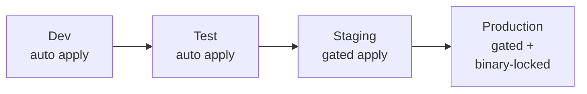
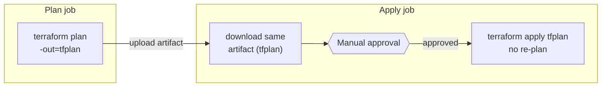

I've sat through this exact postmortem more times than I'd like to admit. A Terraform pipeline that looks disciplined on paper (dev, test, staging, production, all gated, all reviewed) but quietly re-plans right before it applies. Someone merges an unrelated change to `main` while a production approval is sitting in someone's inbox. By the time the approver clicks "Approve," the plan that gets *applied* isn't the plan they *saw*.

Nobody notices until something in production doesn't match what was reviewed. Then everyone spends an afternoon in the AWS console trying to figure out whether it was human error, drift, or the pipeline itself. It's usually the pipeline.

On a recent professional-services engagement, we rebuilt a four-environment (dev → test → staging → production) landing zone pipeline in GitHub Actions and Terraform to close that gap. There was a second, quieter problem too: nobody actually knew if the *live* infrastructure matched the *last applied* Terraform state, because nothing checked in between deployments. Here's how the pipeline ended up looking, and the two changes that made the biggest difference.

## The shape of the pipeline

At a high level, each environment promotion looks the same, with the blast radius (and the friction) increasing as you move toward production.



Dev and test auto-apply on merge. That's the whole point of those environments: fast feedback, low blast radius. Staging adds a manual gate before apply. Production adds the same gate, but with one structural difference that turns out to matter a lot: *the thing being approved is the exact thing that gets applied*, not a fresh plan run after the approval.

## Why "plan, then apply" isn't actually one operation

The default mental model for a Terraform pipeline is: run `terraform plan`, a human reads it, someone clicks approve, then `terraform apply` runs. What usually happens in a naive GitHub Actions setup is that the "approve" step gates a *second job* that re-runs plan-and-apply together, because that's the path of least resistance to wire up.

That gap between the reviewed plan and the applied plan is where surprises live: a teammate's merge lands in the window, a provider version resolves differently, a data source returns a different value because something changed upstream. None of that is exotic. It's just what happens when there's a live gap between review and execution.

The fix is what I've taken to calling the **plan-binary-across-gate** pattern: generate the plan once, save it as a binary artifact, gate on that specific artifact, and apply *that exact binary* instead of running a fresh one.



```yaml
# .github/workflows/deploy-production.yml
jobs:
  plan:
    runs-on: ubuntu-latest
    environment: production-plan
    steps:
      - uses: actions/checkout@v4
      - uses: hashicorp/setup-terraform@v3

      - name: Terraform Init
        run: terraform init

      - name: Terraform Plan
        run: terraform plan -out=tfplan -input=false

      - name: Upload plan artifact
        uses: actions/upload-artifact@v4
        with:
          name: tfplan-production-${{ github.sha }}
          path: tfplan
          retention-days: 5

  apply:
    needs: plan
    runs-on: ubuntu-latest
    environment: production-apply   # this is the manual approval gate
    steps:
      - uses: actions/checkout@v4
      - uses: hashicorp/setup-terraform@v3

      - name: Download plan artifact
        uses: actions/download-artifact@v4
        with:
          name: tfplan-production-${{ github.sha }}

      - name: Terraform Init
        run: terraform init

      - name: Terraform Apply
        run: terraform apply -input=false tfplan
```

Two GitHub Environments do the real work here: `production-plan` runs freely, but `production-apply` has a required reviewer configured against it, so the job pauses until someone approves. When it resumes, it applies the artifact the plan job uploaded, tied to that exact commit SHA. There's no second `terraform plan` anywhere in the apply job. If someone else merges to `main` in the meantime, it simply doesn't affect this run; it'll show up in the *next* plan, reviewed on its own terms.

The nice side effect is that the pipeline also becomes a better audit trail. The artifact itself (human-readable via `terraform show tfplan`) is exactly what the approver saw, retained for a few days, and attributable to a specific commit and a specific approver.

## The second problem: drift nobody's watching for

Gating the pipeline solves "does what gets applied match what was reviewed." It doesn't solve "does what Terraform thinks exists match what's actually running in the account." Consoles get clicked in during incidents, break-glass changes happen, and sometimes a resource just drifts on its own (ASG desired counts are a classic offender). None of that shows up until the next deployment happens to touch the same resource, and that could be weeks away.

The fix here is boring and effective: a scheduled workflow that plans against every environment every night and reports drift without ever applying anything.

```yaml
# .github/workflows/drift-detection.yml
on:
  schedule:
    - cron: '0 18 * * *'   # ~5am AEST, well outside business hours

jobs:
  drift-check:
    strategy:
      matrix:
        environment: [dev, test, staging, production]
    runs-on: ubuntu-latest
    steps:
      - uses: actions/checkout@v4
      - uses: hashicorp/setup-terraform@v3

      - name: Terraform Init
        run: terraform init

      - name: Detect drift
        id: plan
        run: |
          terraform plan -detailed-exitcode -input=false
          echo "exitcode=$?" >> "$GITHUB_OUTPUT"
        continue-on-error: true

      - name: Notify on drift
        if: steps.plan.outputs.exitcode == '2'
        run: |
          curl -X POST "$SLACK_WEBHOOK_URL" \
            -H 'Content-Type: application/json' \
            -d "{\"text\": \"⚠️ Drift detected in ${{ matrix.environment }}\"}"
        env:
          SLACK_WEBHOOK_URL: ${{ secrets.SLACK_WEBHOOK_URL }}
```

The trick is `-detailed-exitcode`: Terraform returns `0` for no changes, `1` for an error, and `2` when there's a diff. That's exactly the signal you want to hook a notification off, without needing to parse plan output. Running it as a matrix job across all four environments keeps the workflow file small and gives you per-environment pass/fail visibility in the Actions UI, which matters more than it sounds like it should when you're triaging at 8am and want to know if it's just dev or if it's production.

Production drift gets routed to a louder channel than dev/test drift. Most dev drift turns out to be someone (often me) testing something and forgetting to clean it up. Production drift is worth a five-minute look every single time.

## What this bought us

Neither of these changes is exotic on its own. Plenty of teams already do one or the other. What made the difference on this engagement was doing both together: the gate stopped being theatre and started guaranteeing an *honest* approval process, and the nightly job stopped state from silently going stale between deployments. Production changes got boring, in the best sense of the word. Reviewers could trust that what they were looking at was what would actually run, and drift stopped being something you found by accident.

If you're auditing your own pipeline, the fastest way to check whether you have the re-plan problem is to look at your apply job and ask: does it call `terraform plan` anywhere? If the answer is yes, that's worth fixing before anything else on this list.
